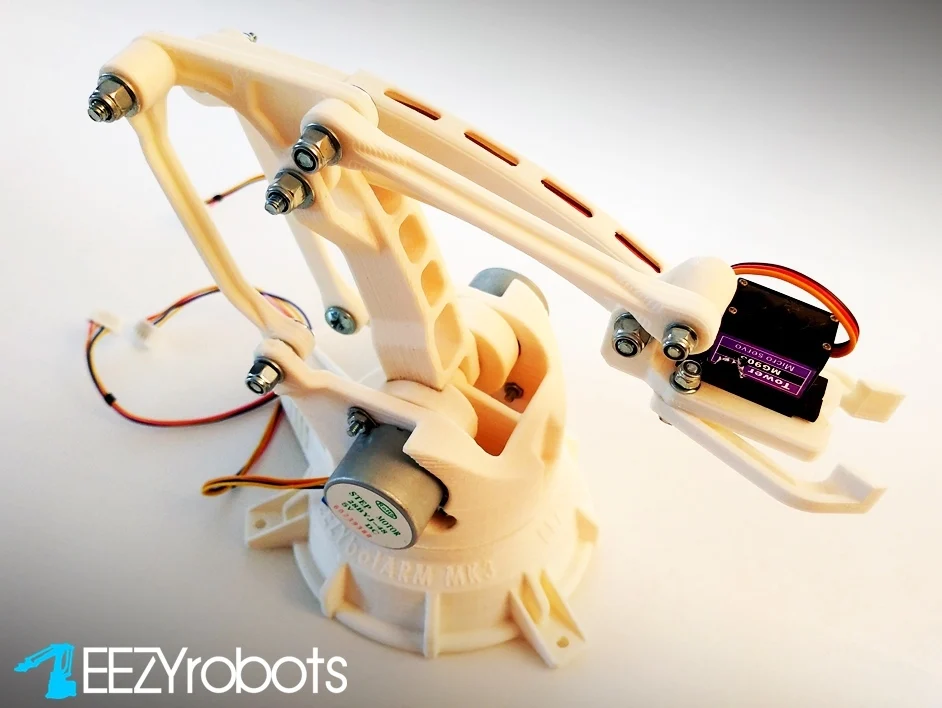

# Robot Arm Project

## Introduction
This project builds and controls a robot arm using three stepper motors (28BYJ-48) and one servo motor (MG996) on the Arduino Mega 2560 platform. The robot arm performs a series of movements, such as rotating the arm, picking up an object, and dropping it in a repetitive cycle. This project can be applied in automation, robotics, and educational purposes.

## Main Components
- **3 Stepper Motors (28BYJ-48)**: Controls the arm's rotation and up/down movement.
- **1 Servo MG996**: Controls the robot's gripper.
- **Arduino Mega 2560**: The main controller for motors and input/output devices.

## Hardware Configuration
- **Stepper Motors (28BYJ-48)** are connected to the control pins of the Arduino Mega (IN1, IN2, IN3, IN4 for each motor).
- **Servo MG996** is connected to the A1 pin of the Arduino Mega.

## Action Description
In the `loop()` function, the robot performs the following actions:
1. **Pick up an object**:
   - Stepper motors 1 and 3 move the arm down.
   - Stepper motor 2 rotates the arm to the correct position.
   - The servo rotates to 90 degrees to close the gripper.
2. **Lift the object**:
   - Stepper motors 1 and 3 move the arm back to the upright position.
   - Stepper motor 2 rotates back to the original position.
3. **Drop the object**:
   - Stepper motors 1 and 3 lower the arm again.
   - The servo opens to release the object.

## Installation and Usage
### Software Requirements:
- **Arduino IDE**: To program the Arduino Mega 2560.
- **Servo Library**: For controlling the servo motor.
- **Stepper Library**: For controlling the stepper motors.

### Setup Instructions:
1. Open Arduino IDE and upload the source code to the Arduino Mega 2560.
2. Connect the motors and servo to the following pins:
   - Motor 1 (28BYJ-48): Pins 2, 3, 4, 5.
   - Motor 2 (28BYJ-48): Pins 6, 7, 8, 9.
   - Motor 3 (28BYJ-48): Pins 10, 11, 12, 13.
   - Servo: Pin A1.
3. Install the `Stepper` and `Servo` libraries from the Arduino Library Manager.

## Conclusion
This project demonstrates a robot arm that can perform simple tasks like picking up and dropping objects. It showcases the control of stepper motors and a servo in a robotic and automation system.
